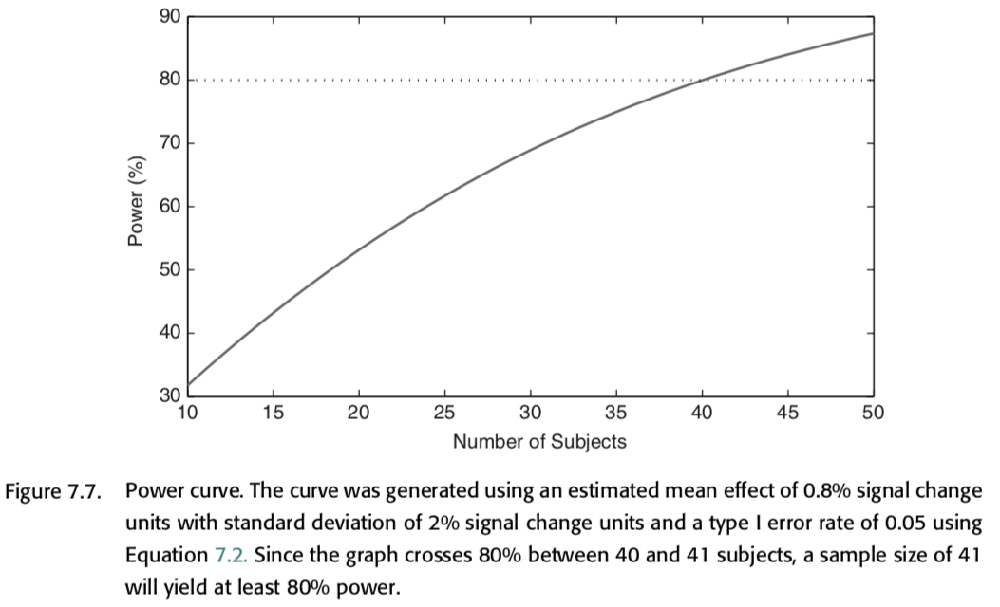
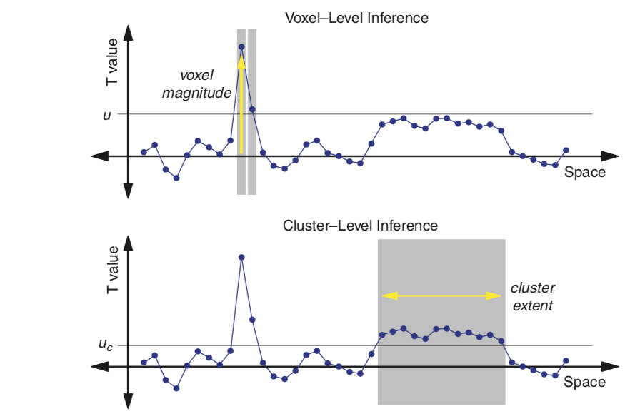
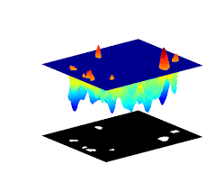
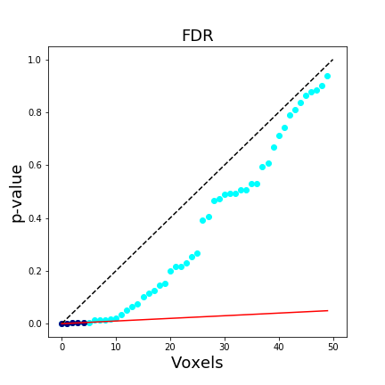
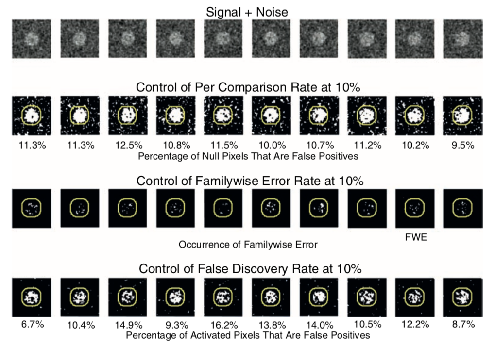

---
redirect_from:
  - "/features/notebooks/12-thresholding-group-analyses"
interact_link: content/features/notebooks/12_Thresholding_Group_Analyses.ipynb
kernel_name: python3
title: 'Thresholding Group Analyses'
prev_page:
  url: /features/notebooks/10_GLM_Single_Subject_Model
  title: 'Modeling Single Subject Data'
next_page:
  url: /features/markdown/Contributing
  title: 'Contributing'
comment: "***PROGRAMMATICALLY GENERATED, DO NOT EDIT. SEE ORIGINAL FILES IN /content***"
---

# Thresholding Group Analyses

*Written by Luke Chang*

The primary goal in fMRI data analysis is to make inferences about how the brain processes information. These inferences can be in the form of predictions, but most often we are testing hypotheses about whether a particular region of the brain is involved in a specific type of process. This requires rejecting a $H_0$ hypothesis (i.e., that there is no effect). Null hypothesis testing is traditionally performed by specifying contrasts between different conditions of an experimental design and assessing if these differences between conditions are reliably present across many participants. There are two main types of errors in null-hypothesis testing.

*Type I error*
- $H_0$ is true, but we mistakenly reject it (i.e., False Positive)
- This is controlled by significance level $\alpha$.

*Type II error*
- $H_0$ is false, but we fail to reject it (False Negative)

The probability that a hypothesis test will correctly reject a false null hypothesis is described as the *power* of the test.

Hypothesis testing in fMRI is complicated by the fact that we are running many tests across each voxel in the brain (hundreds of thousands of tests). Selecting an appropriate threshold requires finding a balance between sensitivity (i.e., true positive rate) and specificity (i.e., false negative rate). There are two main approaches to correcting for multiple tests in fMRI data analysis. *Familywise Error Rate* (FWER) attempts to control the probability of finding *any* false positives. Mathematically, FWER can be defined as the probability $P$ of observing any false positive ${FWER} = P({False Positives}\geq 1)$. While, *False Discovery Rate* (FDR) attempts to control the proportion of false positives among rejected tests. Formally, this is the expected proportion of false positive to the observed number of significant tests ${FDR} = E(\frac{{False Positives}}{{Significant Tests}})$.

This should probably be no surprise to anyone, but fMRI studies are expensive and inherently underpowered. Here is a simulation by Jeannette Mumford to show approximately how many participants you would need to achieve 80% power assuming a specific effect size in your contrast.



**Videos**

For a more in depth overview, I encourage you to watch these videos on correcting for multiple tests by Martin Lindquist & Tor Wager.
 - [Multiple Comparisons](https://www.youtube.com/watch?v=AalIM9-5-Pk)
 - [FWER](https://www.youtube.com/watch?v=MxQeEdVNihg)
 - [FDR](https://www.youtube.com/watch?v=W9ogBO4GEzA)
 - [Thresholds in Practice](https://www.youtube.com/watch?v=N7Iittt8HrU)

# Simulations

Let's explore the concept of false positives to get an intuition about what the overall goals and issues are in controlling for multiple tests.

Let's load the modules we need for this tutorial. We are currently including the SimulateGrid class which contains everything we need to run all of the simulations. Eventually, this will be moved into the nltools package.


{:.input_area}
```python
%matplotlib inline

import os
import glob
import numpy as np
import pandas as pd
import matplotlib.pyplot as plt
import seaborn as sns
from nltools.data import Brain_Data
from scipy.stats import binom, ttest_1samp
from nltools.stats import fdr, one_sample_permutation
from copy import deepcopy

netid = 'f00275v'
output_dir = '/dartfs/rc/lab/P/Psych60/students_output/%s' % netid
data_dir = '/dartfs/rc/lab/P/Psych60/data/brainomics_data/'

class SimulateGrid(object):
    def __init__(self, grid_width=100, signal_width=20, n_subjects=20, sigma=1, signal_amplitude=None):

        self.isfit = False
        self.thresholded = None
        self.threshold = None
        self.threshold_type = None
        self.correction = None
        self.t_values = None
        self.p_values = None
        self.n_subjects = n_subjects
        self.sigma = sigma
        self.grid_width = grid_width
        self.data = self._create_noise()

        if signal_amplitude is not None:
            self.add_signal(signal_amplitude=signal_amplitude, signal_width=signal_width)
        else:
            self.signal_amplitude = None
            self.signal_mask = None

    def _create_noise(self):
        '''Generate simualted data using object parameters

        Returns:
            simulated_data (np.array): simulated noise using object parameters
        '''
        return np.random.randn(self.grid_width, self.grid_width, self.n_subjects) * self.sigma

    def add_signal(self, signal_width=20, signal_amplitude=1):
        '''Add rectangular signal to self.data

        Args:
            signal_width (int): width of signal box
            signal_amplitude (int): intensity of signal
        '''
        if signal_width >= self.grid_width:
            raise ValueError('Signal width must be smaller than total grid.')

        self.signal_amplitude = signal_amplitude
        self.create_mask(signal_width)
        signal = np.repeat(np.expand_dims(self.signal_mask, axis=2), self.n_subjects, axis=2)
        self.data = deepcopy(self.data) + signal * self.signal_amplitude

    def create_mask(self, signal_width):
        '''Create a mask for where the signal is located in grid.'''

        mask = np.zeros((self.grid_width, self.grid_width))
        mask[int((np.floor((self.grid_width/2)-(signal_width/2)))):int(np.ceil((self.grid_width/2)+(signal_width/2))), int((np.floor((self.grid_width/2)-(signal_width/2)))):int(np.ceil((self.grid_width/2)+(signal_width/2)))] = 1
        self.signal_width = signal_width
        self.signal_mask = mask

    def _run_ttest(self, data):
        '''Helper function to run ttest on data'''
        flattened = data.reshape(self.grid_width*self.grid_width, self.n_subjects)
        t, p = ttest_1samp(flattened.T, 0)
        t = np.reshape(t, (self.grid_width, self.grid_width))
        p = np.reshape(p, (self.grid_width, self.grid_width))
        return (t, p)

    def _run_permutation(self, data):
        '''Helper function to run a nonparametric one-sample permutation test'''
        flattened = data.reshape(self.grid_width*self.grid_width, self.n_subjects)
        stats_all = []
        for i in range(flattened.shape[0]):
            stats = one_sample_permutation(flattened[i,:])
            stats_all.append(stats)
        mean = np.reshape(np.array([x['mean'] for x in stats_all]), (self.grid_width, self.grid_width))
        p = np.reshape(np.array([x['p'] for x in stats_all]), (self.grid_width, self.grid_width))
        return (mean, p)

    def fit(self):
        '''Run ttest on self.data'''
        if self.isfit:
            raise ValueError("Can't fit because ttest has already been run.")
        self.t_values, self.p_values = self._run_ttest(self.data)
        self.isfit = True

    def _threshold_simulation(self, t, p, threshold, threshold_type, correction=None):
        '''Helper function to threshold simulation

        Args:
            threshold (float): threshold to apply to simulation
            threshhold_type (str): type of threshold to use can be a specific t-value or p-value ['t', 'p']

        Returns:
            threshold_data (np.array): thresholded data
        '''
        if correction == 'fdr':
            if threshold_type != 'q':
                raise ValueError("Must specify a q value when using fdr")

        if correction == 'permutation':
            if threshold_type != 'p':
                raise ValueError("Must specify a p value when using permutation")

        thresholded = deepcopy(t)
        if threshold_type == 't':
            thresholded[np.abs(t) < threshold] = 0
        elif threshold_type == 'p':
            thresholded[p > threshold] = 0
        elif threshold_type == 'q':
            fdr_threshold = fdr(p.flatten(), q=threshold)
            if fdr_threshold < 0:
                thresholded = np.zeros(thresholded.shape)
            else:
                thresholded[p > fdr_threshold] = 0
        else:
            raise ValueError("Threshold type must be ['t','p','q']")
        return thresholded

    def threshold_simulation(self, threshold, threshold_type, correction=None):
        '''Threshold simulation

        Args:
            threshold (float): threshold to apply to simulation
            threshhold_type (str): type of threshold to use can be a specific t-value or p-value ['t', 'p', 'q']
        '''

        if not self.isfit:
            raise ValueError("Must fit model before thresholding.")

        if correction == 'fdr':
            self.corrected_threshold = fdr(self.p_values.flatten())

        self.correction = correction
        self.thresholded = self._threshold_simulation(self.t_values, self.p_values, threshold, threshold_type, correction)
        self.threshold = threshold
        self.threshold_type = threshold_type

        self.fp_percent = self._calc_false_positives(self.thresholded)
        if self.signal_mask is not None:
            self.tp_percent = self._calc_true_positives(self.thresholded)

    def _calc_false_positives(self, thresholded):
        '''Calculate percent of grid containing false positives

        Args:
            thresholded (np.array): thresholded grid
        Returns:
            fp_percent (float): percentage of grid that contains false positives
        '''

        if self.signal_mask is None:
            fp_percent = np.sum(thresholded != 0)/(self.grid_width**2)
        else:
            fp_percent = np.sum(thresholded[self.signal_mask != 1] != 0)/(self.grid_width**2 - self.signal_width**2)
        return fp_percent

    def _calc_true_positives(self, thresholded):
        '''Calculate percent of mask containing true positives

        Args:
            thresholded (np.array): thresholded grid
        Returns:
            tp_percent (float): percentage of grid that contains true positives
        '''

        if self.signal_mask is None:
            raise ValueError('No mask exists, run add_signal() first.')
        tp_percent = np.sum(thresholded[self.signal_mask == 1] != 0)/(self.signal_width**2)
        return tp_percent

    def _calc_false_discovery_rate(self, thresholded):
        '''Calculate percent of activated voxels that are false positives

        Args:
            thresholded (np.array): thresholded grid
        Returns:
            fp_percent (float): percentage of activated voxels that are false positives
        '''
        if self.signal_mask is None:
            raise ValueError('No mask exists, run add_signal() first.')
        fp_percent = np.sum(thresholded[self.signal_mask == 0] > 0)/np.sum(thresholded > 0)
        return fp_percent

    def run_multiple_simulations(self, threshold, threshold_type, n_simulations=100, correction=None):
        '''This method will run multiple simulations to calculate overall false positive rate'''

        if self.signal_mask is None:
            simulations = [self._run_ttest(self._create_noise()) for x in range(n_simulations)]
        else:
            signal = np.repeat(np.expand_dims(self.signal_mask, axis=2), self.n_subjects, axis=2) * self.signal_amplitude
            simulations = [self._run_ttest(self._create_noise() + signal) for x in range(n_simulations)]

        self.multiple_thresholded = [self._threshold_simulation(s[0], s[1], threshold, threshold_type, correction=correction) for s in simulations]
        self.multiple_fp = np.array([self._calc_false_positives(x) for x in self.multiple_thresholded])
        self.fpr = np.mean(np.array([x for x in self.multiple_fp]) > 0)
        if self.signal_mask is not None:
            self.multiple_tp = np.array([self._calc_true_positives(x) for x in self.multiple_thresholded])
            self.multiple_fdr = np.array([self._calc_false_discovery_rate(x) for x in self.multiple_thresholded])

    def plot_grid_simulation(self, threshold, threshold_type, n_simulations=100, correction=None):
        '''Create a plot of the simulations'''
        if not self.isfit:
            self.fit()
            self.threshold_simulation(threshold=threshold, threshold_type=threshold_type, correction=correction)
        self.run_multiple_simulations(threshold=threshold, threshold_type=threshold_type, n_simulations=n_simulations)

        if self.signal_mask is None:
            f,a = plt.subplots(ncols=3, figsize=(15, 5))
        else:
            f,a = plt.subplots(ncols=4, figsize=(18, 5))
            a[3].hist(self.multiple_tp)
            a[3].set_ylabel('Frequency', fontsize=18)
            a[3].set_xlabel('Percent Signal Recovery', fontsize=18)
            a[3].set_title('Average Signal Recovery', fontsize=18)

        a[0].imshow(self.t_values)
        a[0].set_title('Random Noise', fontsize=18)
        a[0].axes.get_xaxis().set_visible(False)
        a[0].axes.get_yaxis().set_visible(False)
        a[1].imshow(self.thresholded)
        a[1].set_title(f'Threshold: {threshold_type} = {threshold}', fontsize=18)
        a[1].axes.get_xaxis().set_visible(False)
        a[1].axes.get_yaxis().set_visible(False)
        a[2].plot(binom.pmf(np.arange(0, n_simulations, 1), n_simulations, np.mean(self.multiple_fp>0)))
        a[2].axvline(x=np.mean(self.fpr) * n_simulations, color='r', linestyle='dashed', linewidth=2)
        a[2].set_title(f'False Positive Rate = {self.fpr:.2f}', fontsize=18)
        a[2].set_ylabel('Probability', fontsize=18)
        a[2].set_xlabel('False Positive Rate', fontsize=18)
        plt.tight_layout()
```


Okay, let's get started and generate 100 x 100 voxels from $\mathcal{N}(0,1)$ distribution for 20 independent participants. We will run a one sample t-test on each voxel over participants.

Now let's apply a threshold. We can specify thresholds at a specific t-value using the `threshold_type='t'`. Alternatively, we can specify a specific p-value using the `threshold_type='p'`. To calculate the number of false positives, we can simply count the number of tests that exceed this threshold. 

If we run this simulation again 100 times, we can estimate the false positive rate, which is the average number of times we observe any false positives over all of the simulations.


{:.input_area}
```python
threshold = .05
simulation = SimulateGrid(grid_width=100, n_subjects=20)
simulation.plot_grid_simulation(threshold=threshold, threshold_type='p', n_simulations=100)
```


{:.output .output_png}


So this particular threshold (i.e., p < 0.05) results in observing at least one false positive across every one of our simulations.  

What if we looked at a fewer number of voxels? How would this change our false positive rate?


{:.input_area}
```python
threshold = .05
simulation = SimulateGrid(grid_width=5, n_subjects=20)
simulation.plot_grid_simulation(threshold=threshold, threshold_type='p', n_simulations=100)
```


{:.output .output_png}


This simulation shows that examining fewer numbers of voxels will yield considerably less false positives. One common approach to controlling for multiple tests involves only looking for voxels with a specific region (e.g., small volume correction), or looking at average activation within a larger region (e.g., ROI based analyses).

What about if we increase the threshold on our original 100 x 100 grid? 


{:.input_area}
```python
threshold = .0001
simulation = SimulateGrid(grid_width=100, n_subjects=20)
simulation.plot_grid_simulation(threshold=threshold, threshold_type='p', n_simulations=100)
```


{:.output .output_png}


You can see that this dramatically decreases the number of false positives to the point that some of the simulations no longer contain any false positives.

What is the optimal threshold that will give us an $\alpha=0.05$?

To calculate this, we will run 100 simulations at different threshold levels to find the threshold that leads to a false positive rate that is lower than our alpha value.

We could search over t-values, or p-values. Let's explore t-values first.


{:.input_area}
```python
alpha = 0.05
n_simulations = 100
x = np.arange(3, 7, .2)

sim_all = []
for p in x:
    sim = SimulateGrid(grid_width=100, n_subjects=20)
    sim.run_multiple_simulations(threshold=p, threshold_type='t', n_simulations=n_simulations)
    sim_all.append(sim.fpr)

f,a = plt.subplots(ncols=1, figsize=(10, 5))
a.plot(x, np.array(sim_all))
a.set_ylabel('False Positive Rate', fontsize=18)
a.set_xlabel('Threshold (t)', fontsize=18)
a.set_title(f'Simulations = {n_simulations}', fontsize=18)
a.axhline(y=alpha, color='r', linestyle='dashed', linewidth=2)
```


{:.output .output_data_text}
```
<matplotlib.lines.Line2D at 0x115617be0>
```


{:.output .output_png}


As you can see, the false positive rate is close to our alpha starting at a threshold of about 6.2. This means that when we test a hypothesis over 10,000 independent voxels, we can be confident that we will only observe false positives in approximately 5 out of 100 experiments. This means that we are effectively controlling the family wise error rate (FWER). 

Let's use that threshold for our simulation again.


{:.input_area}
```python
simulation = SimulateGrid(grid_width=100, n_subjects=20)
simulation.plot_grid_simulation(threshold=6.2, threshold_type='t', n_simulations=100)
```


{:.output .output_png}


Another way to find the threshold that controls FWER is to divide the alpha by the number of independent tests across voxels. This is called bonferroni correction.

${bonferroni} = \frac{\alpha}{M}$, where $M$ is the number of voxels.


{:.input_area}
```python
grid_width = 100
threshold = 0.05/(grid_width**2)
simulation = SimulateGrid(grid_width=grid_width, n_subjects=20)
simulation.plot_grid_simulation(threshold=threshold, threshold_type='p', n_simulations=100)
```


{:.output .output_png}


This seems like a great way to ensure that we minimize our false positives.

Now what happens when start adding signal to our simulation?

We will represent signal in a smaller square in the middle of the simulation. The width of the square can be changed using the `signal_width` parameter. The amplitude of this signal is controlled by the `signal_amplitude` parameter.

Let's see how well the bonferroni threshold performs when we add 100 voxels of signal.


{:.input_area}
```python
grid_width = 100
threshold = .05/(grid_width**2)
signal_width = 10
signal_amplitude = 1
simulation = SimulateGrid(signal_amplitude=signal_amplitude, signal_width=10, grid_width=grid_width, n_subjects=20)
simulation.plot_grid_simulation(threshold=threshold, threshold_type='p', n_simulations=100)
```


{:.output .output_png}


Here we show how many voxels were identified using the bonferroni correction. We can see that we have an effective false positive rate approximately equal to our alpha threshold. However, our threshold is so high, that we can barely detect any true signal with this amplitude. In fact, we are only recovering about 12% of the voxels that should have signal.

This simulation highlights the main issue with using bonferroni correction in practice. The threshold is so conservative that the magnitude of an effect needs to be unreasonably large to survive correction over hundreds of thousands of voxels.

How well does the bonferroni threshold perform at different signal intensities?  Try playing with different signal amplitudes.


{:.input_area}
```python
grid_width = 100
threshold = .05/(grid_width**2)
signal_amplitude = 1.5
simulation = SimulateGrid(signal_amplitude=signal_amplitude, signal_width=10, grid_width=grid_width, n_subjects=20)
simulation.plot_grid_simulation(threshold=threshold, threshold_type='p', n_simulations=100)
```


{:.output .output_png}


Ok, clearly we can see that the bonferroni threshold is too conservative for this example. We need to double the magnitude of the effect before we can reliably recover most of the signal.

# Family Wise Error Rate

At this point you may be wondering if it even makes sense to assume that each test is independent. It seems reasonable to expect some degree of spatial correlation in our data. Our simulation is a good example of this as we have a square that contains signal across contiguous voxels. In practice, most of our functional neuroanatomy that we are investigating is larger than a single voxel and in addition, we are smoothing the data in preprocessing, which also increases spatial correlation.

It can be shown that the Bonferroni correction is overally conservative in the presence of spatial dependence and results in a decreased power to detect voxels that are truly active.

## Cluster Extent

Another approach to controlling the FWER is called cluster correction, or cluster extent. In this approach, the goal is to identify a threshold such that the maximum statistic exceeds it at a specified alpha. The distribution of the maximum statistic can be approximated using Gaussian Random Field Theory (RFT), which attempts to account for the spatial dependence of the data.  



This requires specifying an initial threshold to determine the *Euler Characteristic* or the number of blobs minus the number of holes in the thresholded image. The number of voxels in the blob and the overall smoothness can be used to calculate something called *resels* or resolution elements and can be effectively thought of as the spatial units that need to be controlled for using FWER. We won't be going into too much detail with this approach as the mathematical details are somewhat complicated. In practice, if the image is smooth and the number of subjects is high enough (around 20), cluster correction seems to provide control closer to the true false positive rate than Bonferroni correction. Though we won't be spending time simulating this today, I encourage you to check out this Python [simulation](https://matthew-brett.github.io/teaching/random_fields.html) by Matthew Brett and this [chapter](https://www.fil.ion.ucl.ac.uk/spm/doc/books/hbf2/pdfs/Ch14.pdf) for an introduction to random field theory.



Cluster extent thresholding has recently become somewhat controversial due to several high profile papers that have found that it appears to lead to an inflated false positive rate in practice (see [Ekland et al., 2017](https://www.pnas.org/content/113/28/7900)). A recent analyses by [Woo et al. 2014](https://www.ncbi.nlm.nih.gov/pmc/articles/PMC4214144/) has shown that a liberal initial threshold (i.e. higher than p < 0.001) will inflate the number of false positives above the nominal level of 5%. There is no optimal way to select the initial threshold and often slight changes will give very different results. Furthermore, this approach does not appear to work equally well across all types of findings. For example, this approach can work well with some amounts of smoothing results that have a particular spatial extent, but not equally well for all types of signals. In other words, it seems potentially problematic to assume that spatial smoothness is constant over the brain and also that it is adequately represented using a Gaussian distribution. Finally, it is important to note that this approach only allows us to make inferences for the entire cluster. We can say that there is some voxel in the cluster that is significant, but we can't really pinpoint which voxels within the cluster may be driving the effect.

There are several other popular FWER approaches to correcting for multiple tests that try to address these issues.

### Threshold Free Cluster Extent
One interesting solution to the issue of finding an initial threshold seems to be addressed by the threshold free cluster enhancement method presented in [Smith & Nichols, 2009](https://www.sciencedirect.com/science/article/pii/S1053811908002978?via%3Dihub). In this approach, the authors propose a way to combine cluster extent and voxel height into a single metric that does not require specifying a specific initial threshold. It essentially involves calculating the integral of the overall product of a signal intensity and spatial extent over multiple thresholds. It has been shown to perform particularly well with combined with non-parameteric resampling approaches such as [randomise](https://fsl.fmrib.ox.ac.uk/fsl/fslwiki/Randomise/UserGuide) in FSL. This method is implemented in FSL and also in [Matlab](https://github.com/markallenthornton/MatlabTFCE) by Mark Thornton. For more details about this approach check out this [blog post](http://markallenthornton.com/blog/matlab-tfce/) by Mark Thornton, this [video](https://mumfordbrainstats.tumblr.com/post/130127249926/paper-overview-threshold-free-cluster-enhancement) by Jeanette Mumford, and the original [technical report](https://www.fmrib.ox.ac.uk/datasets/techrep/tr08ss1/tr08ss1.pdf).

### Parametric simulations
One approach to estimating the inherent smoothness in the data spatial autocorrelation is using parametric simulations this was the approach originally adopted in AFNI's AlphaSim/3DClustSim. After it was [demonstrated](https://www.pnas.org/content/113/28/7900) that real fMRI data was not adequately modeled by a standard Gaussian distribution, the AFNI group quickly updated their software and implemented a range of different algorithms in their [3DClustSim](https://afni.nimh.nih.gov/pub/dist/doc/program_help/3dClustSim.html) tool.  See this [paper](https://www.biorxiv.org/content/10.1101/065862v1) for an overview of these changes.

## Nonparametric approaches
As an alternative to RFT, nonparametric methods use the data themselves to find the appropriate distribution. These methods can provide substantial improvements in power and validity, particularly with small sample sizes, so we regard them as the ‘gold standard’ in imaging analyses. Thus these tests can verify the validity of the less computationally expensive parametric approaches. The FSL tool [randomise](https://fsl.fmrib.ox.ac.uk/fsl/fslwiki/Randomise/UserGuide), is probably the current gold standard and there are versions that run on GPUs, such as [BROCCOLI](https://github.com/wanderine/BROCCOLI) to speed up the computation time.

Here we will run a simulation using a one-sample permutation test (i.e., sign test) on our data. We will make the grid much smaller to speed up the simulation. This approach makes no distributional assumptions, but still requires correcting for multiple tests using either FWER or FDR approaches.


{:.input_area}
```python
grid_width = 4
threshold = .05
signal_amplitude = 1
simulation = SimulateGrid(signal_amplitude=signal_amplitude, signal_width=2, grid_width=grid_width, n_subjects=20)
simulation.t_values, simulation.p_values = simulation._run_permutation(simulation.data)
simulation.isfit = True
simulation.threshold_simulation(threshold, 'p')
simulation.plot_grid_simulation(threshold=threshold, threshold_type='p', n_simulations=100)
```


{:.output .output_png}


# False Discovery Rate
You may be wondering why we need to control for *any* false positive when testing across hundreds of thousands of voxels. Surely a few are okay as long as they don't overwhelm the true signal. The *false discovery rate* (FDR) is a more recent development in multiple testing correction originally described by [Benjamini & Hochberg, 1995](https://rss.onlinelibrary.wiley.com/doi/abs/10.1111/j.2517-6161.1995.tb02031.x). While FWER is the probability of any false positives occurring in a family of tests, the FDR is the expected proportion of false positives among significant tests. 

The FDR is fairly straightforward to calculate.  
 1. We select a desired limit $q$ on FDR, which is the proportion of false positives we are okay with observing (e.g., 5/100 tests or 0.05).
 2. We rank all of the p-values over all the voxels from the smallest to largest. 
 3. We find the threshold $r$ such that $p \leq i/m * q$
 4. We reject any $H_0$ that is lower than $r$.




In a brain map, this means that we expect approximately 95% of the voxels reported at q < .05 FDR-corrected to be true activations (note we use q instead of p). The FDR procedure adaptively identifies a threshold based on the overall signal across all voxels. Larger signals results in lower thresholds. Importantly, if all of the null hypotheses are true, then the FDR will be equivalent to the FWER. This means that any FWER procedure will *also* control the FDR. For these reasons, any procedure which controls the FDR is necessarily less stringent than a FWER controlling procedure, which leads to an overall increased power. Another nice feature of FDR, is that it operates on p-values instead of test statistics, which means it can be applied to most statistical tests.

This figure is taken from Poldrack, Mumford, & Nichols (2011) and compares different procedures to control for multiple tests.


For a more indepth overview of FDR, see this [tutorial](https://matthew-brett.github.io/teaching/fdr.html) by Matthew Brett.

Let's now try to apply FDR to our own simulations. All we need to do is add a `correction='fdr'` flag to our simulation plot. We need to make sure that the `threshold=0.05` to use the correct $q$.


{:.input_area}
```python
grid_width = 100
threshold = .05
signal_amplitude = 1
simulation = SimulateGrid(signal_amplitude=signal_amplitude, signal_width=10, grid_width=grid_width, n_subjects=20)
simulation.plot_grid_simulation(threshold=threshold, threshold_type='q', n_simulations=100, correction='fdr')
print(f'FDR q < 0.05 corresponds to p-value of {simulation.corrected_threshold}')
```


{:.output .output_stream}
```
FDR q < 0.05 corresponds to p-value of 0.00021424473844047038

```


{:.output .output_png}


Okay, using FDR of q < 0.05 for our simulation identifies a p-value threshold of p < 0.00034. This is more liberal than the bonferroni threshold of p < 0.000005 and allows us to recover much more signal as a consequence. You can see that at this threshold there are more false positives, which leads to a much higher overall false positive rate. Remember, this metric is only used for calculating the family wise error rate and indicates the presence of *any* false positive across each of our 100 simulations.

To calculate the empirical false discovery rate, we need to calculate the percent of any activated voxels that were false positives.


{:.input_area}
```python
plt.hist(simulation.multiple_fdr)
plt.ylabel('Frequency', fontsize=18)
plt.xlabel('False Discovery Rate', fontsize=18)
plt.xlabel('False Discovery Rate of Simulations', fontsize=18)
```


{:.output .output_data_text}
```
Text(0.5, 0, 'False Discovery Rate of Simulations')
```


{:.output .output_png}


In our 100 simulations this is below our q < 0.05.

# Thresholding Brain Maps

Today we will be exploring two simple and fast ways to threshold your group analyses.

First, we will simply threshold based on selecting an arbitrary statistical threshold. The values are completely arbitrary, but it is common to start with something like p < .001. We call this *uncorrected* because this is simply the threshold for any voxel as we are not controlling for multiple tests.


{:.input_area}
```python
con1_name = 'horizontal_checkerboard'
con1_file_list = glob.glob(os.path.join(data_dir, '*', f'S*_{con1_name}*nii.gz'))
con1_file_list.sort()
con1_dat = Brain_Data(con1_file_list)
con1_stats = con1_dat.ttest(threshold_dict={'unc':.001})
```


{:.input_area}
```python
f= con1_stats['thr_t'].plot()
```


{:.output .output_stream}
```
threshold is ignored for simple axial plots

```


{:.output .output_png}


We can also easily run FDR correction by changing the inputs of the `threshold_dict`. We will be using a q value of 0.05 to control our false discovery rate.


{:.input_area}
```python
con1_stats = con1_dat.ttest(threshold_dict={'fdr':.05})
```


{:.input_area}
```python
f = con1_stats['thr_t'].plot()
```


{:.output .output_stream}
```
threshold is ignored for simple axial plots

```


{:.output .output_png}


You can see that at least for this particular contrast, the FDR threshold appears to be more liberal than p < 0.001 uncorrected.

Let's look at another contrast between vertical and horizontal checkerboards.


{:.input_area}
```python
con2_name = 'vertical_checkerboard'
con2_file_list = glob.glob(os.path.join(data_dir, '*', f'S*_{con2_name}*nii.gz'))
con2_file_list.sort()
con2_dat = Brain_Data(con2_file_list)

con1_v_con2 = con1_dat-con2_dat

con1_v_con2_stats = con1_v_con2.ttest(threshold_dict={'fdr':.05})
```


{:.input_area}
```python
f = con1_v_con2_stats['thr_t'].plot()
```


{:.output .output_stream}
```
threshold is ignored for simple axial plots

```


{:.output .output_png}


It doesn't look like anything survives this contrast using the correction for multiple tests.

This concludes are very quick overview to performing univariate analyses in fMRI data analysis.

We will continue to add more advanced tutorials to the dartbrains.org website. Stay tuned!
