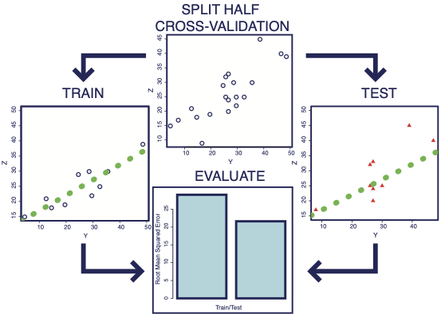
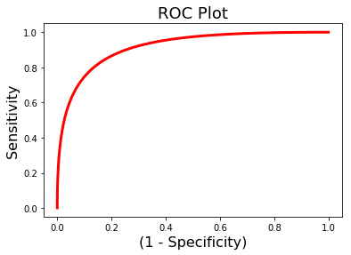
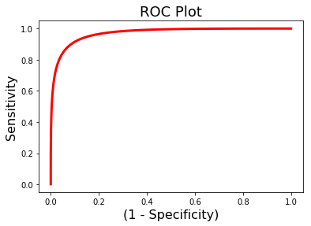
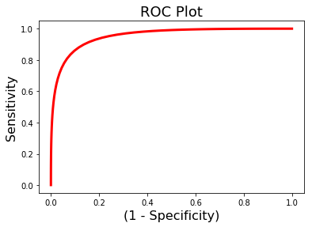

---
redirect_from:
  - "/features/notebooks/14-multivariate-prediction"
interact_link: content/features/notebooks/14_Multivariate_Prediction.ipynb
kernel_name: conda-env-py36-py
title: 'Multivariate Prediction'
prev_page:
  url: /features/notebooks/13_Connectivity
  title: 'Connectivity'
next_page:
  url: /features/notebooks/15_RSA
  title: 'Representational Similarity Analysis'
comment: "***PROGRAMMATICALLY GENERATED, DO NOT EDIT. SEE ORIGINAL FILES IN /content***"
---

# Multivariate Prediction
*Written by Luke Chang*

The statistical methods we have discussed in this course so far have primarily been concerned with modeling activation in a *single voxel* and testing hypotheses in the form of "where in the brain is activation significantly greater in condition A relative condition B". As you may recall this involved using multilevel modeling with the GLM, where a voxel's time course was modeled using a first level GLM and then the contrast effect was aggregated across participants in the second level model. This procedure is often referred to as mass univariate testing and requires carefully considering how to correct for the many tests across voxels.

$$\text{voxel} = \beta \cdot \text{task model} + \beta \cdot \text{covariates} + \epsilon$$

A completely different approach to the problem is to reverse the regression equation and identify patterns of voxel activations that predict an outcome. This might be **classifying** between different conditions of a task, or **predicting** the intensity of a continuous outcome measure (e.g., emotion, pain, working memory load, etc). 

$$\text{outcome} = \sum_{i}^n \beta_i\cdot \text{voxel}_i + \epsilon$$

Here we are learning a model of $\beta$ values across the brain that when multiplied by new data will predict the intensity of a psychological state or outcome or the probability of being a specific state. 

$$\text{predicted outcome} = \text{model} \cdot \text{brain data}$$

This is the general approach behind *supervised learning* algorithms. The intuition behind this approach is that brain signal might not  be functionally localizable to a single region, but instead might be distributed throughout the brain. Patterns of brain activity can thus be used to *decode* psychological states.

The focus of this supervised learning approach is to accurately predict or classify the outcome, whereas the goal in classical statistics is to test hypotheses about which regressor explains the most independent variance of the dependent variable. These two approaches are complementary, but require thinking carefully about different issues. 

In mass-univariate testing, we spent a lot of time thinking carefully about independence of errors (e.g., multi-level models) and correcting for multiple hypothesis tests. In multivariate prediction/classification or **multivoxel pattern analysis** as it is often called, we need to carefully think about **feature selection** -  which voxels we will include in our model, and **cross-validation** - how well our model will *generalize* to new data. In MVPA, we typically have more features (i.e., voxels) then data points, so this requires performing feature selection or a data reduction step. The algorithms used to learn patterns come from the field of machine-learning are very good at detecting patterns, but have a tendency to *overfit* the training data.

In this tutorial, we will cover the basic steps of multivariate prediction/classification:

1. **Data Extraction** - what data should we use to train model?
2. **Feature Selection** - which features or voxels should we use?
3. **Cross-validation** - how do we train and test the model?
4. **Model Interpretation** - how should we interpret the model?

We will be using the nltools toolsbox to run these models, but also see ([nilearn](https://nilearn.github.io/), and [pyMPVA](http://www.pymvpa.org/)). Running MVPA style analyses using multivariate regression is surprisingly easier and faster than univariate methods. All you need to do is specify the algorithm and cross-validation parameters. Currently, we have several different linear algorithms implemented from [scikit-learn](http://scikit-learn.org/stable/) in the nltools package.

We encourage you to read some of the many review papers from [Haynes & Rees, 2006](https://www.nature.com/articles/nrn1931), [Naselaris et al., 2011](https://www.sciencedirect.com/science/article/pii/S1053811910010657), [Haxby et al., 2014](https://www.annualreviews.org/doi/full/10.1146/annurev-neuro-062012-170325), [Woo et al, 2017](http://cosanlab.com/static/papers/Woo_2017_NN.pdf).

Here are some videos from [Principles of fMRI](https://www.youtube.com/channel/UC_BIby85hZmcItMrkAlc8eA/featured) to explain these concepts in more detail:

- [MVPA Theory Part 1](https://www.youtube.com/watch?v=dJIb5bzkQHQ)
- [MVPA Theory Part 2](https://www.youtube.com/watch?v=zKMsJyiL5Dc)

- [MVPA Applications Part 1](https://www.youtube.com/watch?v=87yKz23sPnE)
- [MVPA Applications Part 2](https://www.youtube.com/watch?v=FAyPEr7eu4M)
- [MVPA Applications Part 3](https://www.youtube.com/watch?v=3iXh0FzuAjY)

Finally, there are many great books covering the machine-learning including the freely available [the elements of statistical learning](https://web.stanford.edu/~hastie/Papers/ESLII.pdf) and [pattern recognition and machine-learning](http://users.isr.ist.utl.pt/~wurmd/Livros/school/Bishop%20-%20Pattern%20Recognition%20And%20Machine%20Learning%20-%20Springer%20%202006.pdf).

Here is a helpful [blog post](http://blog.kaggle.com/2016/07/21/approaching-almost-any-machine-learning-problem-abhishek-thakur/) on different algorithms and reasonable default parameters.

## Data Extraction

The first step in MVPA is to decide what data you want to use to predict your outcome variable. Typically, researchers perform a temporal data reduction step, which involves estimating a standard univariate GLM using a single subject first-level model. This model will specify regressors for a single trial, or model a specific condition type over many trials. Just as in the standard univariate approach, these regressors are convolved with an HRF function. These models also usually include nuisance covariates (e.g., motion parameters, spikes, filters, linear trends, etc.). The estimated beta maps from this temporal reduction step are then used as the input data into the prediction model. Note that it is also possible to learn a *spatiotemporal* model that includes the voxels from each TR measured during a a given trial, but this is less common in practice.

First, let's load the modules we need for this analysis.


{:.input_area}
```python
%matplotlib inline

import os
import glob
import numpy as np
import pandas as pd
import matplotlib.pyplot as plt
import seaborn as sns
from nltools.data import Brain_Data

netid = 'f00275v'
base_dir = '/dartfs/rc/lab/P/Psych60/'
base_dir = '/Volumes/Psych60/'
output_dir = os.path.join(base_dir, 'students_output', netid)
data_dir = os.path.join(base_dir, 'data','brainomics_data')
```


Now let's load some data to train a model.

In this example, let's continue to use data from the Pinel Localizer Task that we have been using throughout all of our tutorials. For our first analysis, let's attempt to classify *Left* from *Right* motor activation. We will load a single beta image for each subject that we already estimated in earlier tutorials. We are sorting the files so that subjects are in the same order, then we are stacking all of the images together using `.append()` such that the data looks like $Subject_{1, left}, ... Subject_{n, left}, Subject_{1, right}, ... Subject_{n, right}$.


{:.input_area}
```python
left_file_list = glob.glob(os.path.join(data_dir, '*','*_beta_motor_left_visual.nii.gz'))
left_file_list.sort()
left = Brain_Data(left_file_list)

right_file_list = glob.glob(os.path.join(data_dir, '*','*_beta_motor_right_visual.nii.gz'))
right_file_list.sort()
right = Brain_Data(right_file_list)

data = left.append(right)
```


Next, we need to create the labels or outcome variable to train the model. We will make a vector of ones and zeros to indicate left images and right images, respectively.

We assign this vector to the `data.Y` attribute of the Brain_Data instance.


{:.input_area}
```python
Y = pd.DataFrame(np.hstack([np.ones(len(left_file_list)), np.zeros(len(left_file_list))]))

data.Y = Y
```


okay, we are ready to go. Let's now train our first model. We will use a support vector machine (SVM) to learn a pattern that can discribute left from right motor responses across all 29 participants.


{:.input_area}
```python
svm_stats = data.predict(algorithm='svm', **{'kernel':"linear"})
```


{:.output .output_stream}
```
overall accuracy: 1.00
threshold is ignored for simple axial plots

```


{:.output .output_png}


the results of this analysis are stored in a dictionary.

- **Y**: training labels
- **yfit_all**: predicted labels
- **dist_from_hyperplane_all**: how far the prediction is from the classifier hyperplane through feature space, > 0 indicates left, while < 0 indicates right.
- **intercept**: scalar value which indicates how much to add to the prediction to get the correct class label.
- **weight_map**: multivariate brain model
- **mcr_all**: overall model accuracy in classifying training data


{:.input_area}
```python
print(svm_stats.keys())
```


{:.output .output_stream}
```
dict_keys(['Y', 'yfit_all', 'dist_from_hyperplane_all', 'intercept', 'weight_map', 'mcr_all'])

```

You can see that that the model can perfectly discriminate between left and right using the training data. This is great, but we definitely shouldn't get our hopes up as this model is completely being overfit to the training data. To get an unbiased estimate of the accuracy we will need to test the model on independent data.

We can also examine the model weights more thoroughly by plotting it.  This shows that we see a very nice expected motor cortex representation, but notice that there are many other regions also contributing to the prediction.


{:.input_area}
```python
svm_stats['weight_map'].iplot()
```


{:.output .output_data_text}
```
interactive(children=(FloatText(value=0.0, description='Threshold'), HTML(value='Image is 3D', description='Vo…
```


## Feature Selection

Feature selection describes the process of deciding which features to include when training the model.  Here it is simply, which voxels should we use to train the model?

There are several ways to perform feature selection.  Searchlights are a popular approach.  I personally have a preference for using parcellation schemes.
 - Parcellations are orders of magnitude computationally less expensive than searchlights.
 - Parcellations are easier to correct for multiple comparisons (50 vs 300k)
 - Parcellations can include regions distributed throughout the brain (searchlights are only local)
 - Parcellations can be integrated into a meta-model.
 
Here we download a single 50 parcel map from a forthcoming paper on conducting automated parcellations using neurosynth.

    Yarkoni, T., de la Vega, A., & Chang, L.J. (In Prep).  Fully automated meta-analytic clustering and decoding of human brain activity

Some of the details can be found [here](http://cosanlab.com/static/papers/delaVega_2016_JNeuro.pdf)


{:.input_area}
```python
mask = Brain_Data(os.path.join(base_dir, 'resources', 'masks', 'k50_2mm.nii.gz'))
mask_x = expand_mask(mask)

f = mask.plot()
```


{:.output .output_stream}
```
threshold is ignored for simple axial plots

```


{:.output .output_png}


Let's combine two parcels (left-26 and right-47 motor) to make a mask and use this as a feature extract method.

This means that we will only be training voxels to discriminate between the two conditions if they are in the right or left motor cortex.


{:.input_area}
```python
motor = mask_x[[26,47]].sum()
data_masked = data.apply_mask(motor)

svm_stats_masked = data_masked.predict(algorithm='svm', **{'kernel':"linear"})
```


{:.output .output_stream}
```
overall accuracy: 1.00
threshold is ignored for simple axial plots

```


{:.output .output_png}


{:.input_area}
```python
svm_stats_masked['weight_map'].iplot()
```


{:.output .output_data_text}
```
interactive(children=(FloatText(value=0.0, description='Threshold'), HTML(value='Image is 3D', description='Vo…
```


We can see that this also correctly learns that left motor cortex is positive while right cortex is negative - left vs right classification.  In addition, the training accuracy is still 100%. 

## Cross-Validation

Clearly, our model is overfitting our training data. The next thing we need to do is to estimate how well our model will generalize to *new* data.  Ideally, we would have left out some data to test after we are done training and tuning our models.  This is called **holdout data** and should only be tested once when you are ready to write up your paper.

However, we don't always have the luxury of having so much extra data and also we might want to tune our model using different algorithms, features, or adjusting hyperparameters of the model.

The best way to do this, is to use **cross-validation**. The idea behind this is to subdivide the data into training and testing partitions - k-folds cross-validation is a common method - divide the data into $k$ separate folds and use all of the data except for one fold to train the model and then test the model using the left out fold. We iterate over this process for each fold. For example, consider k=2 or split-half cross-validation.



We divide the data into two partitions. We estimate the model using half of the data and test it on the other half and then evaluate how well the model performed. As you can see from this simulation, the model will almost always fit the training data better than the test data, because it is overfitting to the noise inherent to the training data, which is presumably independent across folds. More training data will lead to better estimation. This means that a k > 2 will usually result in better model estimates. When k=number of subjects, we call this *leave-one-subject-out* cross-validation.

One key concept to note is that it is very important to ensure that the data is independent across folds or this will lead to a biased and usually overly optimistic generalization. This can happen if you have multiple data from the same participant. You will need to make sure that the data from the same participants are held out together. We can do this by passing a vector of group labels to make sure that data within the same group are held out together. Another approach is to make sure that the data is equally representative across folds. We can use something called stratified sampling to achieve this (see [here](http://cosanlab.com/static/papers/Changetal2015PLoSBiology.pdf) for more details)

Let's add cross-validation to our SVM model.  We will start with $k=5$, and will pass a vector indicating subject labels as our grouping variable.


{:.input_area}
```python
sub_list = [x.split('/')[-2] for x in right_file_list]
subject_id = pd.DataFrame(sub_list + sub_list)

svm_stats = data.predict(algorithm='svm', cv_dict={'type': 'kfolds','n_folds': 5, 'subject_id':subject_id}, **{'kernel':"linear"})
```


{:.output .output_stream}
```
overall accuracy: 1.00
overall CV accuracy: 0.93
threshold is ignored for simple axial plots

```


{:.output .output_png}



{:.output .output_png}


Now we see that our whole-brain model is still performing very well ~94% accuracy.

What about our masked version?


{:.input_area}
```python
motor = mask_x[[26,47]].sum()
data_masked = data.apply_mask(motor)

svm_stats_masked = data_masked.predict(algorithm='svm', cv_dict={'type': 'kfolds','n_folds': 5, 'subject_id':subject_id}, **{'kernel':"linear"})
```


{:.output .output_stream}
```
overall accuracy: 1.00
overall CV accuracy: 0.98
threshold is ignored for simple axial plots

```


{:.output .output_png}



{:.output .output_png}


Wow, it looks like the model with feature selection actually outperforms the whole-brain model in cross-validation! 98% > 93% accuracy.

Why do you think this is the case?

## Regularization
Another key concept that is used to help with feature selection is called regularization. Regularization is a method to help deal with [multicollinearity](https://en.wikipedia.org/wiki/Multicollinearity) and also avoid [overfitting](https://en.wikipedia.org/wiki/Overfitting). Overfitting occurs when you have an overly complex model such as having more features(Xs) than observations(Y). For instance, if you try to fit 10 observations with 10 features, each coefficient can be adjusted for a perfect fit but it wouldn't generalize well. In other cases, you might face the problem of feature selection. If you have numerous variables, it is time consuming to try every single combination of features in your model to see what yields the best result. 


Regularization attempts to solve this problem by introducting a loss function that penalizes the model for each additional features added to the model. There are two common types of loss functions *L1* and *L2*. L1 regularization is commonly referred to as *lasso* and leads to sparse solutions, where some regressors are set to zero. L2 regularization, does not lead to a sparse solution, but instead shrinks collinear variables towards zero. Elastic Nets are a type of model that combine L1 and L2 penalizations.

### Lasso regression - L1 Regularization
In short, [Lasso](http://stats.stackexchange.com/questions/17251/what-is-the-lasso-in-regression-analysis) is a feature selection method that reduces the number of features to use in a regression.  
This is useful if you have a lot of variables that are correlated or you have more variables than observations.  

### Ridge Regression - L2 Regularization
The goal of the ridge function is to choose a penalty $\lambda$ for which the coefficients are not rapidly changing and have “sensible” signs. It is especially useful when data suffers from multicollinearity, that is some of your predictor variables are highly correlated. Unlike LASSO, ridge does not produce a sparse solution, but rather shrinks variables that are highly collinear towards zero.

### How do we determine the penalty value?
Both Lasso and Ridge regressions have a penalty hyperparameter $\lambda$. Essentially, we want to select the regularization parameter by identifying the one from a set of possible values (e.g. grid search) that results in the best fit of the model to the data.  However, it is important to note that it is easy to introduce bias into this process by trying a bunch of alphas and selecting the one that works best.  This can lead to optimistic evaluations of how well your model works.

Cross-validation is an ideal method to deal with this.  We can use cross-validation to select the alpha while adding minimal bias to the overall model prediction.

Here we will demonstrate using both to select an optimal value of the regularization parameter alpha of the Lasso estimator from an example provided by [scikit-learn](http://scikit-learn.org/stable/auto_examples/linear_model/plot_lasso_model_selection.html). For cross-validation, we will use a nested cross-validation as implemented by the LassoCV algorithm.


{:.input_area}
```python
ridge_stats = data.predict(algorithm='ridgeClassifier', 
                        cv_dict={'type': 'kfolds','n_folds': 5,'subject_id':subject_id},
                           **{'alpha':.01})
```


{:.output .output_stream}
```
overall accuracy: 1.00
overall CV accuracy: 0.91
threshold is ignored for simple axial plots

```


{:.output .output_png}



{:.output .output_png}


{:.input_area}
```python
ridge_stats = data.predict(algorithm='ridgeCV',
    cv_dict={'type': 'kfolds','n_folds': 5, 'subject_id':subject_id})
```


{:.input_area}
```python
lasso_cv_stats = data.predict(algorithm='lassoCV',
    cv_dict={'type': 'kfolds','n_folds': 5, 'subject_id':subject_id})
```


{:.output .output_traceback_line}
```

    -----------------------------------------------------------------------

    KeyboardInterrupt                     Traceback (most recent call last)

    <ipython-input-102-4c6cf2662323> in <module>
          1 ridge_stats = data.predict(algorithm='lassoCV',
    ----> 2     cv_dict={'type': 'kfolds','n_folds': 5, 'subject_id':subject_id})
    

    ~/anaconda3/envs/py36/lib/python3.6/site-packages/nltools/data/brain_data.py in predict(self, algorithm, cv_dict, plot, **kwargs)
        844 
        845         # Overall Fit for weight map
    --> 846         predictor.fit(self.data, output['Y'])
        847         output['yfit_all'] = predictor.predict(self.data)
        848         if predictor_settings['prediction_type'] == 'classification':


    ~/anaconda3/envs/py36/lib/python3.6/site-packages/sklearn/linear_model/coordinate_descent.py in fit(self, X, y)
       1205                 for train, test in folds)
       1206         mse_paths = Parallel(n_jobs=self.n_jobs, verbose=self.verbose,
    -> 1207                              **_joblib_parallel_args(prefer="threads"))(jobs)
       1208         mse_paths = np.reshape(mse_paths, (n_l1_ratio, len(folds), -1))
       1209         mean_mse = np.mean(mse_paths, axis=1)


    ~/anaconda3/envs/py36/lib/python3.6/site-packages/sklearn/externals/joblib/parallel.py in __call__(self, iterable)
        915             # remaining jobs.
        916             self._iterating = False
    --> 917             if self.dispatch_one_batch(iterator):
        918                 self._iterating = self._original_iterator is not None
        919 


    ~/anaconda3/envs/py36/lib/python3.6/site-packages/sklearn/externals/joblib/parallel.py in dispatch_one_batch(self, iterator)
        757                 return False
        758             else:
    --> 759                 self._dispatch(tasks)
        760                 return True
        761 


    ~/anaconda3/envs/py36/lib/python3.6/site-packages/sklearn/externals/joblib/parallel.py in _dispatch(self, batch)
        714         with self._lock:
        715             job_idx = len(self._jobs)
    --> 716             job = self._backend.apply_async(batch, callback=cb)
        717             # A job can complete so quickly than its callback is
        718             # called before we get here, causing self._jobs to


    ~/anaconda3/envs/py36/lib/python3.6/site-packages/sklearn/externals/joblib/_parallel_backends.py in apply_async(self, func, callback)
        180     def apply_async(self, func, callback=None):
        181         """Schedule a func to be run"""
    --> 182         result = ImmediateResult(func)
        183         if callback:
        184             callback(result)


    ~/anaconda3/envs/py36/lib/python3.6/site-packages/sklearn/externals/joblib/_parallel_backends.py in __init__(self, batch)
        547         # Don't delay the application, to avoid keeping the input
        548         # arguments in memory
    --> 549         self.results = batch()
        550 
        551     def get(self):


    ~/anaconda3/envs/py36/lib/python3.6/site-packages/sklearn/externals/joblib/parallel.py in __call__(self)
        223         with parallel_backend(self._backend, n_jobs=self._n_jobs):
        224             return [func(*args, **kwargs)
    --> 225                     for func, args, kwargs in self.items]
        226 
        227     def __len__(self):


    ~/anaconda3/envs/py36/lib/python3.6/site-packages/sklearn/externals/joblib/parallel.py in <listcomp>(.0)
        223         with parallel_backend(self._backend, n_jobs=self._n_jobs):
        224             return [func(*args, **kwargs)
    --> 225                     for func, args, kwargs in self.items]
        226 
        227     def __len__(self):


    ~/anaconda3/envs/py36/lib/python3.6/site-packages/sklearn/linear_model/coordinate_descent.py in _path_residuals(X, y, train, test, path, path_params, alphas, l1_ratio, X_order, dtype)
       1020     # X is copied and a reference is kept here
       1021     X_train = check_array(X_train, 'csc', dtype=dtype, order=X_order)
    -> 1022     alphas, coefs, _ = path(X_train, y_train, **path_params)
       1023     del X_train, y_train
       1024 


    ~/anaconda3/envs/py36/lib/python3.6/site-packages/sklearn/linear_model/coordinate_descent.py in lasso_path(X, y, eps, n_alphas, alphas, precompute, Xy, copy_X, coef_init, verbose, return_n_iter, positive, **params)
        264                      alphas=alphas, precompute=precompute, Xy=Xy,
        265                      copy_X=copy_X, coef_init=coef_init, verbose=verbose,
    --> 266                      positive=positive, return_n_iter=return_n_iter, **params)
        267 
        268 


    ~/anaconda3/envs/py36/lib/python3.6/site-packages/sklearn/linear_model/coordinate_descent.py in enet_path(X, y, l1_ratio, eps, n_alphas, alphas, precompute, Xy, copy_X, coef_init, verbose, return_n_iter, positive, check_input, **params)
        476             model = cd_fast.enet_coordinate_descent(
        477                 coef_, l1_reg, l2_reg, X, y, max_iter, tol, rng, random,
    --> 478                 positive)
        479         else:
        480             raise ValueError("Precompute should be one of True, False, "


    KeyboardInterrupt: 


```
